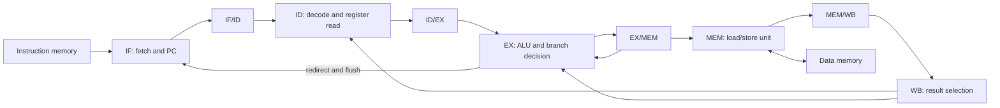

# Five-Stage RISC-V Pipeline with UVM Verification

A 32-bit, in-order RISC-V processor implemented in SystemVerilog, with a five-stage pipeline, data forwarding, load-use stalls, and execute-stage branch resolution. The project implements 37 RV32I integer instructions and includes a UVM environment, a commit-based reference scoreboard, functional coverage, ten SystemVerilog assertions, a Bubble Sort program, and Cadence Genus synthesis results using SKY130 HD cells.

The repository contains the design, simulation and synthesis scripts, synthesis reports and netlists, and screenshots of my results.

## Results

| Measurement | Result | Evidence |
| --- | --- | --- |
| Instruction functional coverage | **100.00%** of the 37 instruction bins | [Full test, seed 25](docs/images/coverage-seed25.png) |
| Pipeline functional coverage | **98.41%** | [Full test, seed 25](docs/images/coverage-seed25.png) |
| Random-seed regression | **1,000 seeds passed, 0 failures** (first version of the regression script; see note) | [Regression summary](docs/images/regression-1000-pass.png) |
| Stimulus per seed | 80 fixed directed instructions + 60 random instructions | [Full-test sequence](tb_simple/uvm/riscv_full_sequence.sv) |
| Full-test scoreboard, seed 25 | **682 commits, 0 errors** | [Coverage and scoreboard output](docs/images/coverage-seed25.png) |
| Bubble Sort | **PASS**, output `1 2 4 5 8` | [Program result](docs/images/bubblesort-result.png) |
| Bubble Sort performance | **169 cycles / 121 retired instructions = 1.397 CPI** | [Program result](docs/images/bubblesort-result.png) |
| Tightest synthesis target met | **4 ns / 250 MHz**, +2.0 ps slack | [4 ns QoR report](synth/reports/4ns/qor.rpt) |
| Cell area at 4 ns | **71,966.523 µm²** | [4 ns area report](synth/reports/4ns/area.rpt) |

**Note on the regression:** the 1,000-seed run used the first version of my regression script. The run covered seeds 1–1000; the screenshot heading still says “100 SEED” only because I forgot to update the label when I raised the seed count. It also shows two harmless shell errors from lines that used `//` instead of `#` for comments. I have since fixed the script so it also checks the simulator exit status and requires complete UVM and scoreboard summaries. I have not yet rerun all 1,000 seeds with the stricter version.

## Architecture



| Stage | Main functions | Main source files |
| --- | --- | --- |
| IF | Reset PC to zero, select sequential or redirected PC, fetch instruction | `pc_unit.sv`, `if_id_reg.sv` |
| ID | Decode controls, read registers, build immediates, apply WB-to-ID bypass | `decoder.sv`, `regfile.sv`, `immgen.sv`, `id_ex_reg.sv` |
| EX | Select forwarded operands, execute ALU operations, evaluate branches and jump targets | `alu.sv`, `branch_cond.sv`, `forwarding_unit.sv`, `ex_mem_reg.sv` |
| MEM | Generate addresses and byte strobes; select and extend load data | `lsu.sv`, `mem_wb_reg.sv` |
| WB | Select ALU, load, or PC+4 result and write the register file | `wbmux.sv` |

[`riscv_core_top.sv`](rtl/riscv_core_top.sv) connects the stages. [`riscv_pkg.sv`](rtl/riscv_pkg.sv) defines the control word, operation selectors, and NOP encoding.

### Data and control hazards

- EX/MEM forwarding has priority over MEM/WB forwarding when both match a source register. Register zero is excluded.
- Forwarding controls use `00` for the saved operand, `01` for MEM/WB, and `10` for EX/MEM.
- Load results are forwarded from MEM/WB. A dependent instruction behind a load holds the PC and IF/ID register and inserts an ID/EX bubble.
- WB-to-ID bypass makes a result available to an instruction decoding during the same cycle as writeback.
- Branches, JAL, and JALR resolve in EX. A redirect invalidates younger instructions in IF/ID and ID/EX. JALR clears target bit zero.
- Forwarded register operands also feed branch comparisons and store data.

The hazard detector compares both instruction source-field positions without decoding whether each is used. This is conservative and can introduce an unnecessary stall for an immediate field that happens to match a pending load destination.

### Instruction support

| Category | Instructions | Count |
| --- | --- | ---: |
| Register arithmetic and logic | ADD, SUB, SLL, SLT, SLTU, XOR, SRL, SRA, OR, AND | 10 |
| Immediate arithmetic and logic | ADDI, SLTI, SLTIU, XORI, ORI, ANDI, SLLI, SRLI, SRAI | 9 |
| Loads | LB, LH, LW, LBU, LHU | 5 |
| Stores | SB, SH, SW | 3 |
| Conditional branches | BEQ, BNE, BLT, BGE, BLTU, BGEU | 6 |
| Upper immediates and jumps | LUI, AUIPC, JAL, JALR | 4 |
| **Total** | | **37** |

This is an educational RV32I integer subset. There is no trap/interrupt controller, CSR unit, multiplication/division extension, compressed instruction support, or complete illegal-instruction checking. Unrecognized opcodes, including FENCE and SYSTEM encodings, leave the decoder's controls inactive. No ISA compliance suite result is claimed.

### Memory interface

The core exposes separate instruction and data ports, with no ready/valid response handshake or variable-latency memory support.

| Signal | Direction at the core | Purpose |
| --- | --- | --- |
| `imem_addr[31:0]` | Output | Instruction byte address |
| `imem_rdata[31:0]` | Input | Instruction word |
| `dmem_addr[31:0]` | Output | Data byte address |
| `dmem_wdata[31:0]` | Output | Store data positioned in byte lanes |
| `dmem_wstrb[3:0]` | Output | Store byte enables; zero for reads |
| `dmem_req` | Output | Active load or store |
| `dmem_rdata[31:0]` | Input | Memory read word |

The testbench provides 1,024 words each of instruction and data memory, indexed by address bits `[11:2]`. Addresses outside that 4 KiB window alias in these models. Reads are driven on the falling clock edge in the UVM driver, and stores update enabled byte lanes on the rising edge. The LSU expects naturally aligned halfword and word accesses; it does not implement misalignment traps or accesses crossing word boundaries. There is no AXI interface in this repository.

## Verification environment

```text
UVM test -> sequence -> sequencer -> driver -> instruction/data memory -> DUT
                                                                      |
                                                 interface <- pipeline and commit signals
                                                      |
                                                   monitor
                                                  /       \
                                           scoreboard    coverage

Assertions are bound directly to riscv_core_top.
```

The driver loads instruction transactions before execution and models memory. The monitor publishes fetched instructions, writeback activity, memory signals, stalls, redirects, and forwarding controls.

The scoreboard maintains a reference register file, byte-addressed memory, and expected next PC. It decodes the instruction associated with each valid commit, predicts register results and control flow, and reports mismatches. Reference stores update its memory model so later loads can be checked. It does not independently compare every store bus transaction. The Bubble Sort test additionally checks the final contents of the driver's data memory.

Commit visibility is connected to internal MEM/WB signals in `tb_uvm_top.sv`; it is not a separate architectural output port on the core.

### Tests

| Test | Purpose |
| --- | --- |
| `riscv_smoke_test` | Basic ADDI, ADD, and SUB bring-up |
| `riscv_directed_test` | Directed instruction-category checks |
| `riscv_hazard_test` | Dependent operations, load-use stalls, forwarding, and taken-branch flushing |
| `riscv_random_test` | 60 generated arithmetic, shift, and aligned LW/SW instructions |
| `riscv_full_test` | 80 fixed transactions plus 60 generated instructions; runs for 700 rising clock edges after its reset sequence |
| `riscv_bubblesort_test` | Sort five values, check memory, and measure cycles and retired instructions |

Each full-test seed loads 80 fixed directed instructions followed by 60 random instructions.

`riscv_sequence.sv` and `riscv_test.sv` are my early bring-up files and are not part of the current UVM package or `run.sh`. The separate `tb_core.sv` testbench reads `program.hex`, prints registers, and checks x0; it is not the full UVM verification flow.

### Functional coverage

[`riscv_coverage.sv`](tb_simple/uvm/riscv_coverage.sv) samples the instruction covergroup at commit and the pipeline covergroup on monitor transactions.

- Instruction coverage contains one wildcard bin for each of the 37 listed instructions.
- Pipeline coverage includes stalls, redirects, both forwarding selectors, memory requests, byte-write strobes, and a cross of the two forwarding selectors.
- The saved seed-25 run reports 100.00% instruction coverage and 98.41% pipeline coverage, with 682 scoreboard commits and zero scoreboard errors.

I intentionally kept a `0110` halfword-write bin in the strobe coverpoint. The LSU only generates the aligned halfword strobes `0011` and `1100`, so this bin is never hit; that is why pipeline coverage is 98.41% rather than 100%.

These percentages describe functional covergroups. They do not establish 100% RTL code coverage or exhaustive architectural correctness.


### Assertions

[`riscv_assertions.sv`](tb_simple/uvm/riscv_assertions.sv) contains ten named properties, connected through [`riscv_bind.sv`](tb_simple/uvm/riscv_bind.sv):

1. Legal forwarding selection for operand A.
2. Legal forwarding selection for operand B.
3. A detected load-use dependency requests a stall.
4. The PC holds after a stall.
5. IF/ID PC and instruction hold after a stall.
6. A redirect flushes IF/ID and ID/EX validity.
7. Pipeline control signals are known.
8. Active writeback destination and data are known.
9. Memory strobes belong to the allowed set.
10. A valid memory-stage instruction does not assert read and write together.

The assertions are included in the simulation file list. The saved seed-25 output and failure-message search recorded no assertion failures; assertion coverage and formal proof results are not included.

### Regression debugging

An earlier 100-seed run reported **88 passes and 12 failures**. I traced the seed-9 failure to the scoreboard's arithmetic-right-shift model: signed and unsigned operands mixed in one expression lost the sign extension. After I fixed the scoreboard, the next run reported **1,000 passes and zero failures**.

See [the debugging notes](docs/debugging.md) for the failing seeds, the seed-9 mismatch, and the fix.


## Bubble Sort program

[`riscv_bubblesort_sequence.sv`](tb_simple/uvm/riscv_bubblesort_sequence.sv) loads machine-code instructions that initialize and sort five integers:

```text
Input:   5 1 4 2 8
Output:  1 2 4 5 8
```

The program exercises nested loops, signed comparisons, loads, stores, forwarding, load-use stalls, and redirects. It writes a completion marker to byte address `0x100`. The test stops when the completion store at PC `0x6c` is observed as committed.

The recorded run measured **169 cycles** and **121 retired instructions**, giving `169 / 121 = 1.397` CPI to three decimal places. These are the test's counters over its reset-release-to-completion window, not a universal CPI for the core.


The [full Bubble Sort output](docs/images/bubblesort-full-output.png) shows 120 scoreboard commits and zero errors, versus the test's 121 retired instructions. The test samples at the falling edge and ends at completion, while the monitor samples at the rising edge. This leaves the terminal observation out of the scoreboard's reported count. That run also had covergroup collection disabled, so its displayed 0.00% coverage does not replace the separate seed-25 coverage result.

### Pipeline waveform

The waveform shows stage-valid signals, register destinations, forwarding, a load-use stall, redirect activity, commits, and data-memory traffic during Bubble Sort.


## Synthesis characterization

I generated these reports on September 28, 2026 using **Cadence Genus 25.13-s071_1**. The synthesis script uses `sky130_fd_sc_hd__tt_025C_1v80.lib`: SKY130 HD at the typical 25 °C, 1.8 V corner. The reports describe pre-layout synthesis with `Wireload mode: top` and timing-library area. The library itself is not bundled.

The table uses the exact slack and area values in each `qor.rpt`. Report clock periods and slack are in picoseconds; the target column converts periods to nanoseconds. The detailed timing reports round some slack values to whole picoseconds.

| Target | Frequency | Worst slack | Violating paths | Cells | Sequential cells | Cell area (µm²) | Report |
| --- | ---: | ---: | ---: | ---: | ---: | ---: | --- |
| 10 ns | 100 MHz | +13.7 ps | 0 | 5,143 | 1,523 | 68,775.963 | [QoR](synth/reports/10ns/qor.rpt) |
| 8 ns | 125 MHz | +13.7 ps | 0 | 5,258 | 1,523 | 69,217.636 | [QoR](synth/reports/8ns/qor.rpt) |
| 6 ns | 166.7 MHz | +0.4 ps | 0 | 5,456 | 1,523 | 69,716.865 | [QoR](synth/reports/6ns/qor.rpt) |
| 5 ns | 200 MHz | +4.6 ps | 0 | 5,555 | 1,523 | 70,179.809 | [QoR](synth/reports/5ns/qor.rpt) |
| **4 ns** | **250 MHz** | **+2.0 ps** | **0** | **5,971** | **1,523** | **71,966.523** | [QoR](synth/reports/4ns/qor.rpt) |

Each target directory contains `area.rpt`, `timing.rpt`, `qor.rpt`, `gates.rpt`, and `riscv_core_netlist.v`.

Area increases by approximately **4.64%** from the 10 ns target to the 4 ns target. Sequential cell count remains at 1,523, while combinational cell count increases from 3,620 to 4,448.

| Targets | Critical-path endpoints in the reports | Interpretation from the RTL |
| --- | --- | --- |
| 10, 8, 6 ns | MEM/WB destination register → PC register | Forwarding selection feeding execute-stage redirect logic |
| 5 ns | MEM/WB writeback selector → EX/MEM ALU-result register | Writeback selection, forwarding, and ALU path |
| 4 ns | EX/MEM destination register → EX/MEM ALU-result register | Forwarding selection and ALU path |

The gate-level reports establish the endpoints; the datapath descriptions are interpretations based on the RTL. All five targets are met under the script's constraints. **250 MHz is a met pre-layout target, not a measured silicon frequency or proven maximum frequency.** Place-and-route, extracted timing, multi-corner signoff, and tighter failing targets are not included.

## Repository layout

```text
RISCV-32I/
├── rtl/                    # processor RTL and shared package
├── tb_simple/
│   ├── tb_core.sv          # early standalone register-dump test
│   ├── imem_model.sv
│   ├── dmem_model.sv
│   └── uvm/                # active UVM environment, tests and assertions
├── sim/
│   ├── filelist.f
│   ├── run.sh              # one test with coverage
│   └── regression.sh       # full test across seeds, coverage disabled
├── synth/
│   ├── run_genus.tcl
│   └── reports/            # 10ns, 8ns, 6ns, 5ns and 4ns results
├── docs/
│   ├── images/             # result and waveform screenshots
│   └── debugging.md
├── program.hex             # instruction image for tb_core.sv
├── LICENSE                 # MIT license
├── .gitignore
├── .gitattributes
└── README.md
```

Simulator databases, coverage databases, and logs are not committed; synthesis reports and netlists are. The repository history also contains my earlier single-cycle version of the core.

## License

This project is licensed under the [MIT License](LICENSE).

Copyright (c) 2026 Charan Gundepinni.
