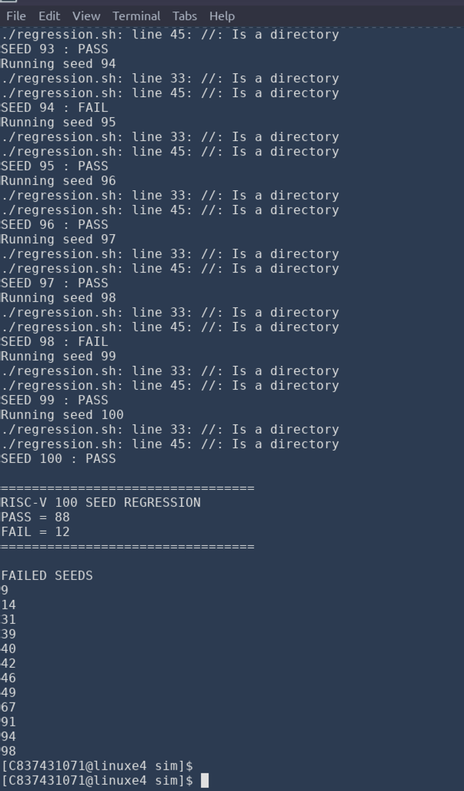
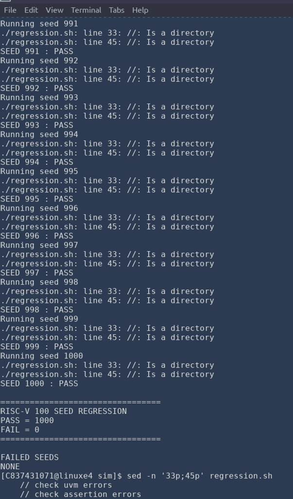

# Regression debugging record

## Initial failure

The supplied screenshot of the earlier 100-seed regression reports **88 passes and 12 failures**:

```text
9 14 31 39 40 42 46 49 67 91 94 98
```



The prior project discussion includes this seed-9 log excerpt:

```text
PC = 0000017c  INSTR = 41845793
REG FAIL PC=0000017c expected x15=000000ff got x15=ffffffff
```

`0x41845793` encodes `SRAI x15, x8, 24`. The mismatch led to inspection of the scoreboard's arithmetic-right-shift handling. The earlier model used a conditional expression combining a signed arithmetic shift and an unsigned logical shift. Mixing those operands can make the conditional expression unsigned and defeat the intended sign extension.

## Correction present in the uploaded project

The uploaded scoreboard already uses explicit branches for both SRA and SRAI. For SRAI:

```systemverilog
if (instr[30])
    result = $signed(a) >>> instr[24:20];
else
    result = a >> instr[24:20];
```

The cleanup preserves this code and adds a short comment explaining why the signed expression is kept separate. No processor logic was changed for this packaging task.

This is a documented example from seed 9 and the correction present in the archive. The retained evidence does not include a separate root-cause trace for every one of the twelve failing seeds.

## Later regression result

The later supplied screenshot reaches seed 1000 and reports:

```text
PASS = 1000
FAIL = 0
FAILED SEEDS
NONE
```



The same screenshot retains the old “100 SEED” heading and shell messages saying `//: Is a directory`. Those messages came from two comment lines written with `//` instead of Bash's `#`. They were separate from the scoreboard signedness issue: changing comments alone does not correct instruction-result mismatches.

The cleaned runner uses valid comments, derives its heading from the requested seed count, removes each stale simulation log before rerunning it, checks Xcelium's return status, and requires complete UVM and scoreboard summaries. It also retains assertion-message checks and detects simulator errors. The 1,000-pass screenshot was produced by the original runner, before these stricter checks were added.

## Evidence available

The repository includes the original before/after regression screenshots, coverage output, Bubble Sort output, a successful Bubble Sort pipeline waveform, and synthesis screenshots. The twelve failing seeds' raw logs and a failure-specific waveform are not included in the supplied files. The failure diagnosis above uses the log excerpt from the prior project discussion and the source in the ZIP.
